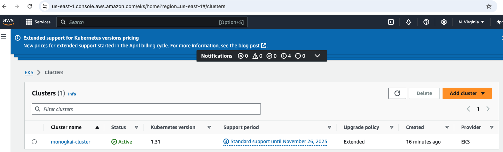

# Deploy EKS Cluster Using Terraform and Jenkins

## Steps:
1) Create EC2 instance with "Monogkai-EKS" name in AWS account
    - Select ubuntu AMI
    - Select Instance type t2.medium
    - Create a new Key Pair named monogkai and the download of monogkai.pem is done
    - Select Create security group, allowing SSH traffic, HTTPS traffic from the internet and HTTP traffic from the internet, anywhere 0.0.0.0/0
    - Add installer.sh file content in user data field
    - Launch instance
    - Add 8080 port for TCP protocol for Inbound rules in Security Groups
    - Identify the Public IP: 35.175.242.150

    
    

2) Create a IAM user
    - User name Monogkai
    - Associate to a User Group
    - Create Access key, select Command Line Interface (CLI)

    

3) Try to access the instance using the browser
    - I had some issues to access the instance in my browser but it was easy to access via command line. For some reason, it was necessary to update the Java version
    - Use http://35.175.242.150:8080/ in the browser

    

4) Setup Jenkins
    - Obtain the administrator password and past it
        - Connect to AWS Instance Console and write "sudo cat /var/lib/jenkins/secrets/initialAdminPassword": a6901412695442fda91c3a34ef8487e3
    - Select "Install suggested plugins"
    - Create First Admin User
    - Add new item
        - Select Pipeline option
        - Add Pipeline Script, equal to the jenkins/Jenkinsfile content
        - Obtain the checkout content step by clicking in Pipeline Syntax link
    - Add credentials
        - Go to Dashboard > Manage Jenkins > Credentials > Click Global > Click on the Add Credentials
        Select Secret text kind option
    - Add pipeline parameters
        - Configure > General > Select Choice Parameter
        - Add Name action
        - Add Choices "apply" and "destroy"

    

5) Build pipeline
    - I click on the Build with parameters
    - Select apply option
    - Wait until the pipeline finishes

    
    

6) Interact in cluster
    - Go to AWS EKS > Cluster. Verify the cluster was created successfully
    - Interact with the cluster via command line ans add a new pod to run nginx
        - Use ssh -i ~/.ssh/monogkai.pem ubuntu@35.175.242.150 command
        - aws configure
        - aws eks update-kubeconfig --region us-east-1 --name monogkai-cluster
        - kubectl run nginx --image=nginx
        - kubectl get pods
        

    

## References
- 