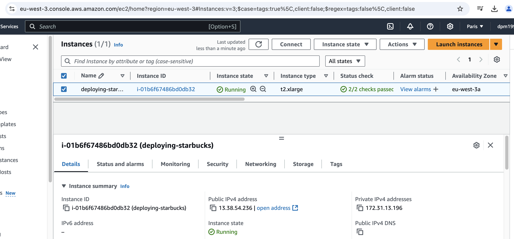

# Deploying Starbucks Clone on AWS EKS using DevSeOps Approach

Steps:
1) Create a AWS instance
    - Name "deploying-starbucks"
    - Select ubuntu
    - Select t2.xlarge
    - Create a new key pair named "deploying-starbucks-key-pair"
    - Create a new security group
    - In Configure storage section, select 1 x 30 GiB gp3
    - Identify the Public IP: 13.39.242.27
    - Connect locally to the instance created
        - Open an SSH client.
        - Locate your private key file. The key used to launch this instance is deploying-starbucks-key-pair.pem
        - chmod 400 "deploying-starbucks-key-pair.pem"
        - ssh -i "deploying-starbucks-key-pair.pem" ubuntu@13.39.242.27

    

2) Install "installer.sh" dependencies in the instance

3) Run docker to run Sonarqube
    - docker run -d --name sonar -p 9000:9000 sonarqube:lts-community
    - docker ps
    - Use http://13.39.242.27:9000

4) Configure Jenkins account
    - Login using using http://13.39.242.27:8080
        - Use "sudo cat /var/lib/jenkins/secrets/initialAdminPassword" in AWS CLI to get the admin password
        - Create Jenkins user
    - Add plugins
        - Eclipse Temurin installer
        - Sonarqube Scanner
        - NodeJs
        - OWASP Dependency-Check
        - Docker
        - Docker Commons
        - Docker Pipeline
        - Docker API
        - docker-build-step
        - Pipeline: Stage View
        - Prometheus metrics
        - Email Extension Template
    - Click "Restart Jenkins when installation is complete and no jobs are running" option

5) Configure Sonarqube
    - Login (admin, admin)
    - Change password
    - Create token

4) Configure tools in Jenkins account
    - Go to Dashboard > Manage Jenkins > Tools
    - JDK installations: select jdk17, Install from adoptium.net, jdk-17.0.8.1+1
    - SonarQube Scanner installations: select sonar-scanner, Install from Maven Central, SonarQube Scanner 6.2.0.4584
    - NodeJS installations, node16, Install from nodejs.org, NodeJS 16.20.0
    - Dependency-Check installations, DP-Check, Install from github.com dependency-check 10.0.4
    - Docker installations: docker, latest

5) Add credentials in Jenkins account
    - Go to Dashboard > Manage Jenkins > Credentials
    - Click global
    - Add sonar credential: Use the token created and the name is "Sonar-token"
    - Add docker credential: Use my email has username and the name used is docker-cred
    - Add Gmail credentials: it's necessary to create a App password in Gmail named "jenkins". The credential name is "mail-cred"

6) Configure System in Jenkins account
    - In SonarQube servers, add a "sonar-server" and the Server Url is "http://13.39.242.27:9000". In "Server authentication token", select "Sonar-token"
    - In Extended E-mail Notification, add "smtp.gmail.com" in SMTP server. Add "465" in "SMTP Port"
        - Click in Advanced, and select "Use SSL" and select "Use OAuth 2.0". And select "docker-cred" in Credentials
    - In E-mail Notification, add "smtp.gmail.com" in SMTP server. I click on the Advanced, select "Use SMTP Authentication", add my email in username, use the password generated. Select Use SSL. Add "465" in "SMTP Port". Add email in "Reply-To Address". I select "Test configuration by sending test email" using my email
    - Build triggers: select always, failure - any, success

7) Create new item named "amazon-starbucks"
    - Paste the pipeline script and change the email in this content
    - Trigger pipeline

8) Create a webhook in SonarQube
    - Name: "jenkins"
    - URL: "http://13.38.54.236:8080/sonarqube-webhook/"

9) Create a second instance to be used to do the remaining tasks
    - Name: monitering-server
    - Use the sane security-group and key-pair
    - Access the instance via terminal

10) Configure monitoring tools
    - Install Prometheus run the commands
    - Open the :9090
    - Install Node Explorer
    - Complete node_explorer.service file
    - Configure prometheus.yml

## References
- https://www.youtube.com/watch?v=uaiuUGg5gLE&t=862s